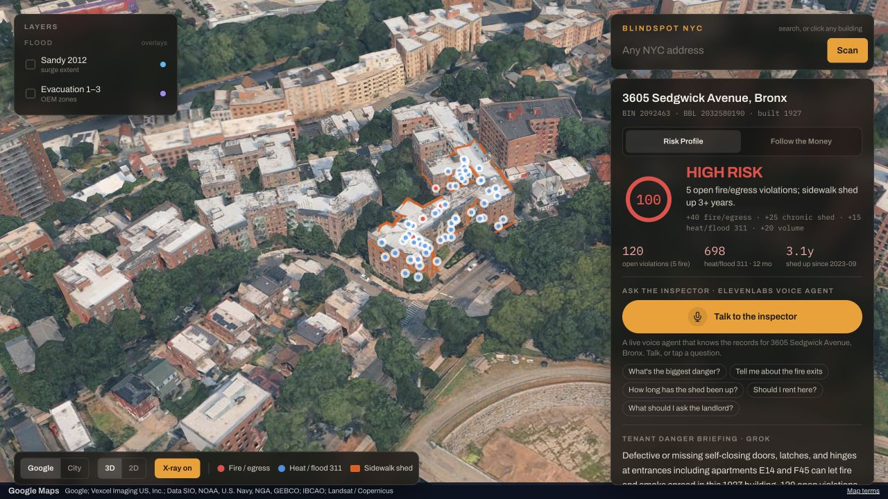
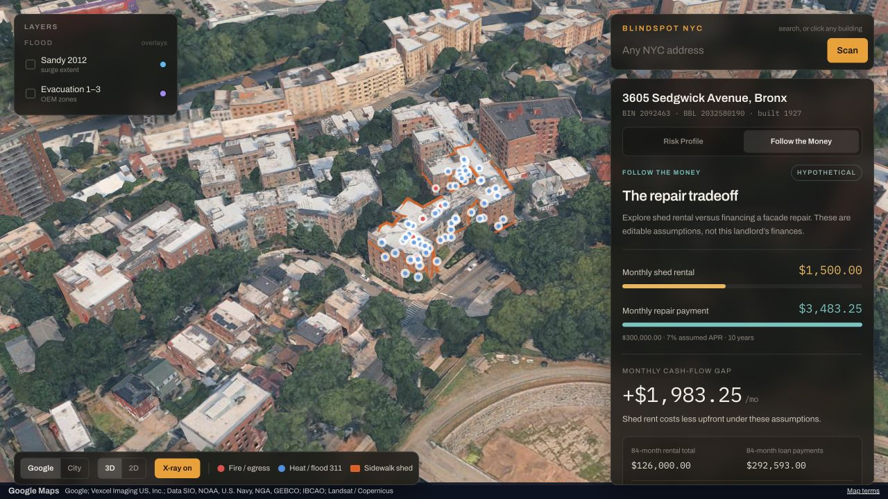
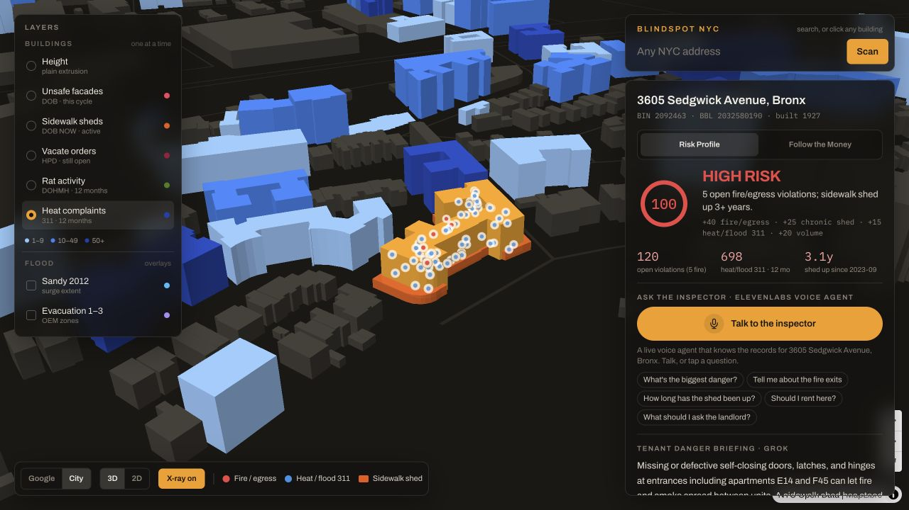
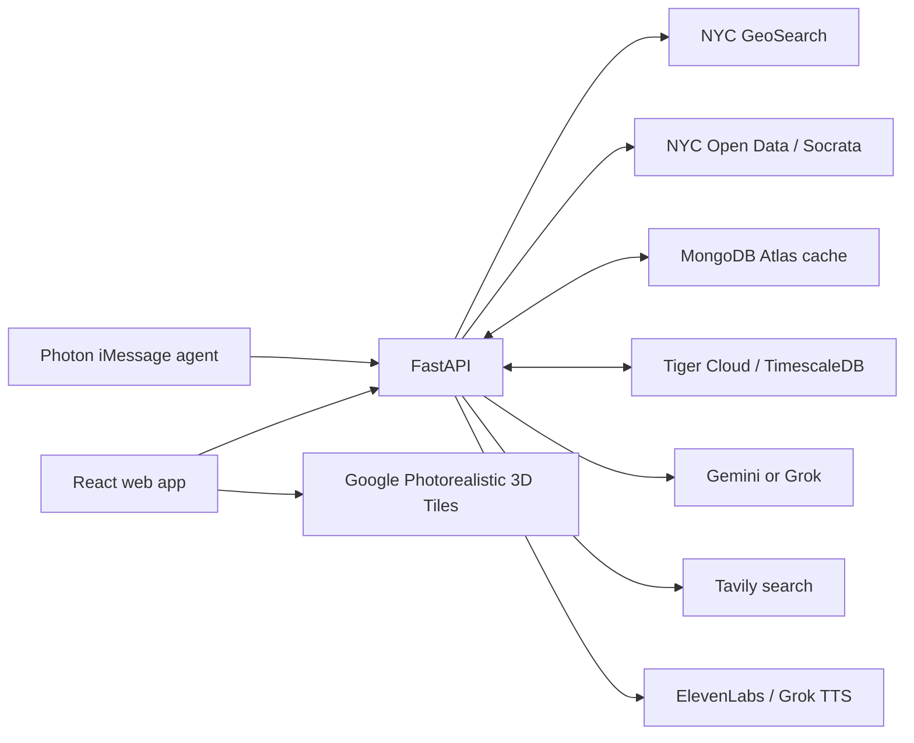

# BlindSpot NYC

**See the building records that a rental listing leaves out.**

BlindSpot NYC turns New York City's public building records into an interactive risk report. Search an address or select a building on the map to explore fire and egress violations, long-running sidewalk sheds, heat and sewer complaints, and the history behind them. The app explains its score, writes a plain-English briefing, and can read that briefing aloud or answer questions through a voice inspector.

[Live demo](https://blindspot-nyc.vercel.app/) · [Devpost](https://devpost.com/software/blindspot-x87p4j) · [Source code](https://github.com/7dracoder/BlindSpotNYC) · [NYC Open Data](https://opendata.cityofnewyork.us/)

> BlindSpot is a screening tool built from public records. Its score is a project-defined index, not an official city rating or a probability of harm. Missing records and a low score do not establish that a building is safe.




## Try the demo

1. Open [3605 Sedgwick Avenue, Bronx](https://blindspot-nyc.vercel.app/?q=3605%20Sedgwick%20Avenue%2C%20Bronx) to explore a high-score report. Inspect the component points, shed history, and retrieved records.
2. Compare [3322 Bailey Avenue, Bronx](https://blindspot-nyc.vercel.app/?q=3322%20Bailey%20Avenue%2C%20Bronx). Its current snapshot scores 35 rather than 100; records and scores can change as city data refreshes.
3. Switch **Google / City**, try the civic layers, and turn on **Sandy 2012** or **Evacuation 1–3** for geographic context.
4. Read the Grok briefing, play the ElevenLabs audio, or talk to the voice inspector. Open **Follow the Money → Edit assumptions** to explore a hypothetical repair scenario.

### Integration status

| Capability | Implementation and verification |
| --- | --- |
| Public-record reports and scores | Live on Vercel; deterministic scoring and source timestamps |
| Google 3D and City maps | Live; map gestures preserve the size of floating controls |
| Grok, ElevenLabs, Tavily | Briefings, audio, voice sessions, and address-matched coverage implemented; the live voice inspector was exercised in the browser |
| Tiger Data | Deployed annual complaint trends verified against the Tiger-backed response |
| MongoDB Atlas | Snapshot and geospatial caching implemented; local connectivity verified. Vercel encountered connection failures, so cloud durability remains unverified |
| Follow the Money | Local amortization calculator works without a banking API; all inputs are visible and editable |
| Nessie | Legacy optional adapter implemented; live transactions and a self-hosted replacement are not verified |
| Photon Spectrum | Separate listener connected; terminal report lookup passed. Phone delivery remains unverified after a project-routing rejection |

Development used Cursor, Gemini, and OpenAI Codex. The deployed briefing model is Grok; development tools are distinct from runtime integrations.

## Contents

- [What the app does](#what-the-app-does)
- [Architecture and request flow](#architecture-and-request-flow)
- [Technology stack](#technology-stack)
- [Public data sources](#public-data-sources)
- [How scoring works](#how-scoring-works)
- [Follow the Money](#follow-the-money--nessie-integration)
- [Run locally](#run-locally)
- [Environment variables](#environment-variables)
- [Google 3D map setup and troubleshooting](#google-3d-map-setup-and-troubleshooting)
- [API reference](#api-reference)
- [Optional integrations](#optional-integrations)
- [Deploy to Vercel](#deploy-to-vercel)
- [Deploy to DigitalOcean](#deploy-to-digitalocean)
- [Repository layout](#repository-layout)
- [Verification and development](#verification-and-development)
- [Data limits and operational considerations](#data-limits-and-operational-considerations)

## What the app does

- **Address search:** Autocomplete NYC addresses and resolve each building to a Building Identification Number (BIN), tax-lot identifier (BBL), and coordinates.
- **Two map views:** Explore Google's Photorealistic 3D Tiles or the City map built with Blocklight and MapLibre. Switch between 2D and 3D, pan, zoom, and rotate with modifier-key dragging.
- **Follow the Money:** Compare assumed shed rent with a fixed-rate facade repair loan. Edit the assumptions, see monthly and cumulative cash-flow differences, and optionally store fictional account, purchase, and loan records in Capital One Nessie.
- **Explainable risk report:** View a 0–100 score, a LOW/MODERATE/HIGH label, the component scores, violation counts, complaint counts, and sidewalk-shed age.
- **X-ray overlays:** Inspect red fire/egress markers, blue heat and flood complaint markers, and an orange sidewalk-shed outline around the selected building.
- **Citywide layers:** Color City-map buildings by unsafe facades, active sheds, vacate orders, rat activity, or heat complaints. Show Sandy inundation and hurricane evacuation zones in either map view.
- **Briefing and audio:** Read a short tenant briefing generated from the retrieved records, with a rules-based fallback. Listen to an audio version when a TTS provider is configured.
- **Voice inspector:** Ask an ElevenLabs conversational agent about the selected building's report, using speech or the suggested questions.
- **Historical context:** View ten calendar years of heat/flood complaints and matching press or listing coverage.
- **Previously scanned buildings:** Open nearby reports from the application's cache.
- **Shareable reports:** The `?q=<address>` URL opens and scans an address directly.
- **Optional iMessage access:** A separate Photon Spectrum agent accepts addresses and replies with the report and a web-map link.

### Financial scenario



The defaults produce a $3,483.25 monthly loan payment versus $1,500 assumed shed rent. The $1,983.25 difference is a hypothetical cash-flow comparison, not observed profit or proof of owner intent.

### City layers



City view links public records to building geometry. Flood overlays and building age are contextual inputs today; neither adds points to the shipped hazard score.

## Architecture and request flow



A scan follows this sequence:

1. **Resolve the address.** NYC GeoSearch returns a BIN, BBL, borough, and coordinates. The resolver rejects many overly broad fuzzy matches and placeholder BINs. Google-map clicks use reverse geocoding; City-map clicks also carry the selected footprint's BIN.
2. **Reuse a fresh snapshot.** A building cached less than 12 hours ago can be returned immediately. Otherwise, the API requests shed permits, HPD/DOB violations, 311 complaints, and the building footprint concurrently.
3. **Normalize and score the records.** The backend identifies fire/egress conditions, links permit renewals into a shed history, counts selected complaint types, and computes the four score components. Failed sources are listed in `data_gaps`.
4. **Build historical context.** The API normally requests grouped annual 311 counts. If Tiger Cloud is available, it imports the underlying complaint rows into TimescaleDB and queries annual buckets and a trend insight there.
5. **Return the building.** The UI flies to the address and displays the report while the briefing and news requests run.
6. **Generate the explanation.** Gemini is selected when configured, otherwise Grok. If the selected provider fails, a rules-based briefing is returned. News comes from Tavily and is filtered for an address match.
7. **Generate optional audio.** ElevenLabs TTS is tried first, then Grok TTS. The voice inspector is a separate interactive ElevenLabs WebRTC session supplied with the building report.

MongoDB stores `buildings` and `analyses`, with unique BIN indexes and a `2dsphere` index for nearby lookups. Building freshness is checked by application code; it is not a MongoDB TTL index. Analyses are valid only for the building's `fetched_at` snapshot. Rules-based fallback analyses are intentionally not persisted so a later request can retry the model.

Without MongoDB, reports are cached in process memory. Without Tiger Cloud, annual trends still work through NYC Open Data.

## Technology stack

| Area | Tools | Purpose |
| --- | --- | --- |
| Web UI | React 19, TypeScript 6 | Search, report state, controls, and interactive components |
| Voice button | [Watermelon UI Shimmer Button](https://registry.watermelon.sh/r/shimmer-button.json) | Animated inspector button adapted to the app palette, with keyboard focus and reduced motion support |
| Frontend tooling | Vite 8, npm, Oxlint | Local server, API proxy, production bundle, and linting |
| Styling | Tailwind CSS 4, Archivo, IBM Plex Mono | Dark map interface, panels, and readable report typography |
| City renderer | Blocklight, MapLibre GL JS | NYC footprint extrusions and building datasets joined by BIN |
| Financial simulation | Capital One Nessie, Python Decimal, httpx | Fictional account/purchase/loan records and local fixed-rate payment calculations |
| 3D and overlays | deck.gl 9 with TerrainExtension, loaders.gl 4 | Google 3D tile streaming, surface-aligned GeoJSON layers and markers, and shed outlines |
| API | Python 3.11+, FastAPI, Uvicorn | Asynchronous HTTP API and production static-file serving |
| Validation/config | Pydantic, pydantic-settings | Response schemas and environment-driven configuration |
| HTTP clients | HTTPX, browser Fetch API | Public-data and integration requests |
| Report cache | MongoDB Atlas, Motor | Persistent building/analysis snapshots and geospatial queries |
| Historical storage | Tiger Cloud, TimescaleDB, asyncpg | 311 row ingestion, hypertables, annual trend queries |
| Briefings | Google Gemini or xAI Grok | Short explanations grounded in retrieved records |
| Audio/voice | ElevenLabs TTS, ElevenLabs Agents, `@elevenlabs/react`, Grok TTS | Audio files and interactive voice sessions |
| News | Tavily | Address-specific search results |
| Messaging | Photon Spectrum, `spectrum-ts`, tsx | Optional iMessage and terminal agent |
| Packaging/deployment | uv, Docker, Vercel, DigitalOcean App Platform, GitHub Actions | Locked dependencies, a production container, hosting, and verification |

The deployment guides follow [DigitalOcean’s environment-variable documentation](https://docs.digitalocean.com/products/app-platform/how-to/use-environment-variables/) and [Dockerfile build reference](https://docs.digitalocean.com/products/app-platform/reference/dockerfile/).

Exact resolved dependency versions are recorded in `frontend/package-lock.json`, `photon-agent/package-lock.json`, and `backend/uv.lock`. The deployment container uses Node 22 to build the frontend and Python 3.13 for the API.

## Public data sources

The application queries [NYC GeoSearch](https://geosearch.planninglabs.nyc/) and the Socrata resource API at `https://data.cityofnewyork.us/resource`.

| Record / layer | Dataset | How it is used |
| --- | --- | --- |
| Addresses and identifiers | NYC GeoSearch v2 | Address autocomplete, BIN/BBL resolution, reverse geocoding |
| DOB NOW approved permits | [`rbx6-tga4`](https://data.cityofnewyork.us/d/rbx6-tga4) | Sidewalk-shed permits and the active-sheds layer |
| DOB BIS permit issuance | [`ipu4-2q9a`](https://data.cityofnewyork.us/d/ipu4-2q9a) | Legacy equipment/sidewalk-shed permit history |
| HPD Housing Maintenance Code violations | [`wvxf-dwi5`](https://data.cityofnewyork.us/d/wvxf-dwi5) | Open class B/C violations, including selected class C fire/egress conditions |
| DOB safety violations | [`855j-jady`](https://data.cityofnewyork.us/d/855j-jady) | Active building-system violations; selected energy/compliance paperwork is excluded |
| 311 service requests | [`erm2-nwe9`](https://data.cityofnewyork.us/d/erm2-nwe9) | Heat/hot-water, sewer-backup, and catch-basin complaints and annual trends |
| Building footprints | [`5zhs-2jue`](https://data.cityofnewyork.us/d/5zhs-2jue) | Geometry, roof height, ground elevation, construction year, and BBL-to-BIN joins |
| Street centerlines | [`inkn-q76z`](https://data.cityofnewyork.us/d/inkn-q76z) | City-map street geometry |
| Borough boundaries | [`gthc-hcne`](https://data.cityofnewyork.us/d/gthc-hcne) | City-map land geometry |
| Facade inspection records | [`xubg-57si`](https://data.cityofnewyork.us/d/xubg-57si) | Unsafe facades in cycle 10 and cycle 9 buildings not yet refiled in cycle 10 |
| HPD vacate orders | [`tb8q-a3ar`](https://data.cityofnewyork.us/d/tb8q-a3ar) | Open vacate orders, aggregated by BIN |
| Rat inspections | [`p937-wjvj`](https://data.cityofnewyork.us/d/p937-wjvj) | Failed rat-activity inspections in the last 365 days |
| Sandy inundation | [`5xsi-dfpx`](https://data.cityofnewyork.us/d/5xsi-dfpx) | Historical surge-extent overlay |
| Hurricane evacuation zones | [`epne-qv9x`](https://data.cityofnewyork.us/d/epne-qv9x) | Zone 1–3 overlays |

A shed is treated as active when its permit is unexpired and not signed off. Older permits whose coverage ends within 90 days of the next permit are treated as continuous coverage. This is a permit-based estimate of shed age, rather than a measurement of physical installation or removal.

Complaint matching uses BBL **or** normalized street address, because condo units may carry different tax-lot identifiers. For the citywide heat layer, complaints on a lot are assigned to that lot's tallest footprint.

## How scoring works

### 1. Pitch equation — conceptual / roadmap

$$
\text{Disaster Vulnerability} = w_1(\text{Hazard / Flood Zone}) + w_2(\text{Building Age and Type}) + w_3(\text{Active Violations and 311s})
$$

This is the conceptual model for the pitch, not the formula executed by the backend. The weights are not calibrated or implemented. Flood-zone exposure and building age/type are future scoring inputs; existing flood overlays and year-built metadata currently provide context only.

**Slide wording:** “Today = $w_3$ fully live; $w_1$/$w_2$ are next layers.” Here, “fully live” refers to the shipped record-based index below, rather than a fitted weighted vulnerability model.

### 2. Shipped backend — actual calculation

$$
\text{Hazard Score} = \min\big(100,\; S_{\text{fire}} + S_{\text{shed}} + S_{\text{env}} + S_{\text{repeat}}\big)
$$

The component rules are implemented in [`backend/app/services/scoring.py`](backend/app/services/scoring.py), and [`backend/app/services/nyc_data.py`](backend/app/services/nyc_data.py) sums and caps them at 100. Each component is added once when its trigger is met.

| Term | Points | Shipped trigger |
| --- | ---: | --- |
| $S_{\text{fire}}$ | +40 | At least one flagged fire/egress violation: HPD class C descriptions matching conditions such as self-closing doors, fire escapes, egress, or detectors; or DOB sprinkler, emergency-power, or photoluminescent-device violations |
| $S_{\text{shed}}$ | +25 | An active sidewalk shed with estimated continuous coverage **greater than 730 days** |
| $S_{\text{env}}$ | +15 | **At least three** selected 311 heat/sewer/catch-basin complaints in the last 365 days |
| $S_{\text{repeat}}$ | +20 | Retrieved open violations plus selected recent complaints total **more than five** |

The fire trigger includes both HPD and DOB records; it is broader than “critical DOB egress / self-closing / fire escape.” The table reflects the current code rather than narrowing the shipped behavior to the pitch shorthand.

For example, a building with a flagged fire condition, a shed older than 730 days, and more than five violations/complaints scores `40 + 25 + 20 = 85`. Three qualifying complaints would add the remaining 15 points.

### 3. Dial thresholds

| Hazard score | Backend label | Dial presentation |
| --- | --- | --- |
| 0–20 | LOW | Green |
| 21–59 | MODERATE | Yellow / amber |
| 60–100 | HIGH | Red; pulsing red is the proposed demo treatment |

The backend thresholds and the UI's green/amber/red colors already match these ranges. The current dial is static; pulsing red is a presentation roadmap item, not shipped behavior. If added, pulse only the high-risk dial, and respect reduced-motion preferences.

Citywide rat, facade, vacate, and flood-area layers provide context. They do not independently add points to this formula. The “flood” complaint category specifically covers sewer-backup/catch-basin reports; it is not a modeled flood-risk assessment.

## Follow the Money — Nessie integration

After selecting a building, open **Follow the Money** beside **Risk Profile**. The repair calculator is independent of the hazard score and uses illustrative assumptions, not a landlord's banking records or an actual Capital One loan offer.

Defaults are **$1,500/month shed rent**, **$300,000 repair principal**, **7% annual interest**, a **120-month loan**, and an **84-month comparison**. Use **Edit assumptions → Recalculate** to change them. The comparison horizon is capped at the loan term. It is a user-selected hypothetical horizon, not a claim that the current building has had a shed for seven years. If no active shed is recorded, the panel says so.

For principal $P$, monthly rate $r = \text{annual interest percentage}/1200$, and $n$ payments, BlindSpot calculates:

$$
M = \begin{cases}
P/n, & r = 0 \\
\dfrac{Pr}{1-(1+r)^{-n}}, & r > 0
\end{cases}
$$

The **monthly cash-flow gap** is $M - \text{monthly shed rent}$. Positive means the assumed rental payment is lower; negative means the loan payment is lower. With the defaults, the payment is **$3,483.25**, the monthly gap is **+$1,983.25**, and the 84-month gap is **+$166,593.00**. Totals use displayed monthly amounts rounded to cents; a real loan's final payment can differ. The response also includes total interest calculated from the unrounded amortization payment.

These differences are **not profit, verified savings, or evidence of negligence or intent**. Loan payments repay principal; repairs can change the asset's condition and value. Fees, penalties, rental changes, tax effects, and repair benefits are excluded. Geometry does not establish a rental price; this version does not infer shed cost from footprint size.

### Optional legacy Nessie adapter

The deployed demo uses **Local simulation**. The original service is not a verified dependency of this project. These instructions describe the existing adapter only; they do not guarantee that the provider is available. [Nessie-Credit](https://github.com/chrisfischer/Nessie-Credit) has a different credit-oriented API and is not a drop-in replacement for this adapter’s customer, merchant, account, purchase, and loan routes. A compatible local service would require additional implementation and testing.

1. Obtain a key from [Nessie](https://api.nessieisreal.com/), and put `NESSIE_API_KEY` in `backend/.env`. Restart the backend after changing the environment. Keep the key out of the browser and Git.
2. `NESSIE_API_URL` defaults to `https://prod-api.nessieisreal.com`; the client also permits the official `https://api.nessieisreal.com` HTTPS host. Other hosts and redirects are rejected to avoid forwarding credentials elsewhere.
3. Open **Edit assumptions → Record scenario in Nessie**. Merely looking up a building, opening the tab, or recalculating locally does not write any banking records.
4. On success, expand **View Nessie record IDs** to see the customer, merchant, account, purchase, and loan IDs. The app reads back purchase/loan amounts before marking the ledger synced.

The backend reuses a fictional **BlindSpot Simulation** customer and shed-rental merchant. Each public building BIN gets a mock Checking account with an initial **$1,000,000 fictional balance**, one pending rental purchase representing **one month**, and one pending small-business repair loan with a **fictional credit score of 700**. No real landlord identity, actual balance, or underwriting decision is represented. There is no recurring charge scheduler.

| Nessie operation | Purpose |
| --- | --- |
| `GET/POST /customers` | Find or create the shared fictional customer |
| `GET/POST /merchants` | Find or create the fictional rental merchant |
| `GET/POST /customers/{customerId}/accounts` | Reuse or create a building's mock account |
| `GET/POST /accounts/{accountId}/purchases` | Reuse or create its representative monthly rental purchase |
| `GET/POST /accounts/{accountId}/loans` | Reuse or create its mock repair loan |
| `PUT /purchases/{purchaseId}`, `PUT /loans/{loanId}` | Update the same records when assumptions change |
| `GET /purchases/{purchaseId}`, `GET /loans/{loanId}` | Verify stored amounts |

Nessie's loan schema accepts a `monthly_payment` supplied by the application. **BlindSpot calculates amortization locally** and sends that result; it does not ask Nessie to derive payments from APR and term. The contract follows the official [loan model](https://github.com/nessieisreal/nessie-ios-sdk/blob/master/Nessie-iOS-Wrapper/Loan.swift), [account client](https://github.com/nessieisreal/nessie-javascript-sdk/blob/master/lib/account.js), and [purchase client](https://github.com/nessieisreal/nessie-javascript-sdk/blob/master/lib/purchase.js).

IDs and completed assumptions are cached in MongoDB's `finance` collection, with an in-memory fallback. Cache namespaces distinguish provider hosts and keys without storing the key. Each mutation saves progress; a subsequent request can recover an interrupted creation by finding matching remote records. Identical submissions reuse the ledger, and changing only the comparison horizon makes no new banking records. A process-local lock serializes writes for the current single-process deployment; multiple API workers/replicas would require a distributed lock before enabling concurrent sandbox writes. Remote errors leave the local calculator usable and never fabricate Nessie IDs or expose the key in error messages.

Without a key, the app explicitly shows **Local simulation**. Connecting Nessie and successfully creating records is required to demonstrate actual API usage to judges; a local-only calculator is not a live integration demo.

## Run locally

### Prerequisites

- Node.js 22.12+ and npm; Node 22.18+ is recommended for the test script's native TypeScript support.
- Python 3.11+ and [uv](https://docs.astral.sh/uv/).
- Internet access to GeoSearch and NYC Open Data.
- Optional provider accounts for maps, persistent storage, AI, voice, news, and messaging.

Clone the repository:

```bash
git clone https://github.com/7dracoder/BlindSpotNYC.git
cd BlindSpotNYC
```

### 1. Start the backend

```bash
cd backend
cp .env.example .env
# Edit .env to enable the integrations you want.
uv sync --locked
uv run uvicorn app.main:app --reload --host 127.0.0.1 --port 8000
```

API health: <http://127.0.0.1:8000/api/health> · Interactive API docs: <http://127.0.0.1:8000/docs>

### 2. Start the frontend in another terminal

```bash
cd frontend
cp .env.example .env
# Add a Google Map Tiles key here to enable photorealistic imagery.
npm ci
npm run dev -- --host 127.0.0.1
```

Open <http://127.0.0.1:5173/>. Vite proxies `/api` to the backend on port 8000 and Google `/v1/3dtiles` requests to the tile service during development.

An empty frontend `.env` uses the City renderer. With no backend integration keys, address lookups and scoring still work, briefings use the rules-based explanation, and data is cached in memory.

### 3. Try the demo addresses

- `3605 Sedgwick Avenue, Bronx`
- `957 Woodycrest Avenue, Bronx`
- `76 Saint Nicholas Place, Manhattan`
- `225 West 86 Street, Manhattan`

These are real addresses, not fixture reports. Their scores and records can change. `/?q=3605%20Sedgwick%20Avenue%2C%20Bronx` opens a report directly.

### 4. Optional: pre-warm reports

```bash
cd backend
uv run python scripts/ingest.py
```

This fetches records, briefings, and audio for the four demo addresses. MongoDB must be configured if those snapshots should be available to a different API process. Model/TTS calls may consume provider credits.

## Environment variables

Local `.env` files contain credentials and are excluded from Git and Docker build contexts. Commit only the `.env.example` templates.

### Frontend: `frontend/.env`

| Variable | Default | Purpose |
| --- | --- | --- |
| `VITE_API_URL` | Empty | API origin; empty uses the same origin and Vite's development proxy |
| `VITE_GOOGLE_MAPS_API_KEY` | Empty | Browser-visible key for Google's **Map Tiles API**, including Photorealistic 3D Tiles |

Vite substitutes `VITE_*` values at **build time**. A change requires restarting the development server or rebuilding the production bundle. These values are readable by visitors; they must never contain backend API secrets. Restrict the Google key by API and allowed HTTP referrers.

### Backend: `backend/.env` or deployment runtime environment

| Variable | Default / fallback | Purpose |
| --- | --- | --- |
| `MONGODB_URI` | Empty → memory cache | MongoDB Atlas connection string |
| `MONGODB_DB` | `blindspot` | MongoDB database name |
| `TIGER_DATABASE_URL` | Empty → NYC Open Data trends | TimescaleDB connection string, normally with TLS enabled |
| `GEMINI_API_KEY` | Empty | Preferred briefing provider when configured |
| `GEMINI_MODEL` | `gemini-flash-latest` | Gemini model identifier |
| `XAI_API_KEY` | Empty | Grok briefing provider when Gemini is unset; also optional TTS fallback |
| `XAI_MODEL` | `grok-4.7` | Grok model identifier |
| `ELEVENLABS_API_KEY` | Empty | ElevenLabs TTS and voice-session tokens |
| `ELEVENLABS_VOICE_ID` | `JBFqnCBsd6RMkjVDRZzb` | TTS voice used by the project |
| `ELEVENLABS_AGENT_ID` | Empty | Existing ElevenLabs inspector agent |
| `TAVILY_API_KEY` | Empty → no news | Address-specific news search |
| `NESSIE_API_KEY` | Empty → local financial calculator | Nessie sandbox key, backend only |
| `NESSIE_API_URL` | `https://prod-api.nessieisreal.com` | Allowlisted HTTPS Nessie API origin |
| `PUBLIC_APP_URL` | `http://127.0.0.1:5173` | Public report links in messaging responses |
| `PUBLIC_API_URL` | `http://127.0.0.1:8000` | Public API setting, reserved for integrations; current audio URLs are relative |
| `CORS_ORIGINS` | Localhost/127.0.0.1 on port 5173 | Comma-separated permitted cross-origin web clients |
| `AUDIO_DIR` | `data/audio` | Writable directory for generated MP3s |
| `FRONTEND_DIST` | Empty | Optional compiled frontend directory; set automatically by Docker |
| `PORT` | Docker default `8080` | Listening port used by the container startup command |

Use the model IDs supported by your provider account; defaults are configuration choices, not a guarantee of provider availability. If Gemini is set but fails, the current implementation returns the rules-based briefing rather than trying Grok afterward.

### Photon agent: `photon-agent/.env`

| Variable | Purpose |
| --- | --- |
| `SPECTRUM_PROJECT_ID` | Photon Spectrum project identifier |
| `SPECTRUM_PROJECT_SECRET` | Photon Spectrum project credential |
| `BLINDSPOT_API_URL` | Backend origin; defaults to `http://127.0.0.1:8000` |

## Google 3D map setup and troubleshooting

This project uses **Google Map Tiles API / Photorealistic 3D Tiles** through deck.gl. It does not use the Google Maps JavaScript API widget.

1. Enable Map Tiles API and billing in the Google Cloud project associated with your key.
2. Set `VITE_GOOGLE_MAPS_API_KEY` in `frontend/.env`.
3. Allow the development referrers you use, such as `http://127.0.0.1:5173/*` and `http://localhost:5173/*`, and the exact deployed HTTPS origin.
4. Restart Vite after changing the environment file. On DigitalOcean, set the key as a **build-time** variable and rebuild.
5. Use a browser with WebGL support and working hardware acceleration. High-detail 3D imagery uses substantial GPU memory and network bandwidth.

The tile-fetch adapter normalizes absolute/root-relative child URLs, preserves session query parameters, and attaches the key to tile requests. Development uses the Vite proxy; production fetches the Google tile origin directly. Visible copyright credits are extracted from loaded tiles and shown alongside Google Maps attribution.

| Symptom | Check |
| --- | --- |
| Only City view is available | The Google key was absent when the frontend started or was built |
| Google switches to City view | Read the map status message; check tile requests for authentication, quota, network, or WebGL failures |
| 401 / 403 tile response | Check the key, API enablement, billing, and allowed referrers |
| 429 tile response | Check provider quota and usage |
| Local API requests fail | Verify the backend on port 8000 and `/api/health` |
| Local tiles work but production fails | Verify the build-time key and production HTTP-referrer restrictions |
| Coarse imagery during a fly-to | Allow neighborhood tiles to stream in; switch to City view on slower devices |

The City renderer is a separate fallback using public building geometry. It is not an OpenStreetMap basemap. See [Google's renderer guidance](https://developers.google.com/maps/documentation/tile/create-renderer) and [deck.gl's 3D Tiles guide](https://deck.gl/docs/developer-guide/base-maps/using-with-3d-tiles).

## API reference

All application endpoints use `/api`. FastAPI publishes OpenAPI at `/openapi.json` and interactive documentation at `/docs`.

| Method | Endpoint | Behavior |
| --- | --- | --- |
| GET | `/api/health` | Process health: `{"ok": true}` |
| GET | `/api/search?q=<text>` | Up to six address suggestions; minimum query length two |
| GET | `/api/lookup?q=<address>` | Resolve, retrieve/cache, and score a building |
| GET | `/api/lookup?lng=<lng>&lat=<lat>&bin=<bin>` | Resolve a City-map footprint; omit `bin` for a Google-map click |
| GET | `/api/finance/{bin_id}` | Default financial scenario; no remote banking writes |
| POST | `/api/finance/{bin_id}` | Recalculate with a JSON assumptions body |
| POST | `/api/finance/{bin_id}/nessie` | Create/update and verify fictional Nessie records |
| GET | `/api/analyze/{bin_id}` | Cached or newly generated briefing and news for a previously looked-up building |
| POST | `/api/analyze/{bin_id}/audio` | Generate audio if available and return the analysis with `audio_url`/`audio_engine` |
| GET | `/api/audio/{filename}` | Serve a generated MP3 |
| GET | `/api/voice/{bin_id}/session` | Short-lived ElevenLabs token and dynamic building-report variables |
| GET | `/api/nearby?lng=<lng>&lat=<lat>&meters=1500` | Up to 50 previously scanned nearby buildings; radius capped at 5000 m |
| POST | `/api/sms/lookup` | JSON `{"text":"<address>"}` → reply text and report URL |
| GET | `/api/map/buildings/manifest.json` | City footprint tile manifest, zoom 15 |
| GET | `/api/map/buildings/{x}/{y}.json` | GeoJSON footprint tile |
| GET | `/api/map/streets/{x}/{y}.json` | GeoJSON street tile |
| GET | `/api/map/land.json` | Borough land geometry |
| GET | `/api/map/layers/{layer_id}.json` | Building records or area GeoJSON for one supported layer |

Supported layer IDs: `unsafe-facades`, `active-sheds`, `vacate-orders`, `rat-activity`, `heat-complaints`, `sandy-2012`, and `evacuation-zones`.

Example requests:

```bash
curl 'http://127.0.0.1:8000/api/search?q=3605%20Sedgwick'
curl 'http://127.0.0.1:8000/api/lookup?q=3605%20Sedgwick%20Avenue%2C%20Bronx'
curl -X POST 'http://127.0.0.1:8000/api/sms/lookup' \
  -H 'Content-Type: application/json' \
  -d '{"text":"3605 Sedgwick Avenue, Bronx"}'
```

A building response includes identity and geometry, `shed`, permit/violation/complaint records, aggregate counts, annual trends, `hazard_score`, `risk_label`, `score_breakdown`, `data_gaps`, and `fetched_at`. An analysis response includes the briefing provider, matching news, and optional audio URL/provider.

An unmatched address returns 404; upstream geocoding failures return 502; unconfigured voice returns 503. Individual building-source failures can yield a partial report with `data_gaps` instead of failing the entire lookup.

## Optional integrations

### ElevenLabs voice inspector

Configure `ELEVENLABS_API_KEY` and an existing `ELEVENLABS_AGENT_ID`. To create the project's sample inspector agent:

```bash
cd backend
uv run python scripts/create_voice_agent.py
```

This creates an agent in the configured ElevenLabs account and prints its ID. Save that ID in the backend environment. The API obtains a short-lived conversation token and supplies the address, risk label, and retrieved building report to the frontend. Interactive speech requires HTTPS in production and microphone permission; localhost is suitable for development.

### Tiger Cloud / TimescaleDB

Set `TIGER_DATABASE_URL` to a PostgreSQL service with TimescaleDB support. The connection must allow creation of the `complaints_311` table, hypertable, and index. The startup code creates them if absent. Each lookup can ingest up to 50,000 matching historical rows; `(unique_key, created_at)` prevents duplicate inserts. Annual counts use `time_bucket('1 year', created_at)`.

### Photon iMessage agent

```bash
cd photon-agent
test -f .env || cp .env.example .env
# Configure your Spectrum project and BLINDSPOT_API_URL.
npm ci
npm start
```

The agent listens through Spectrum's iMessage and terminal providers. Messages containing an address are forwarded to `/api/sms/lookup`. Greetings or messages without digits return usage help. This is a separate long-running process and is not included in the web container or default DigitalOcean spec. Do not send a real message during testing unless you intend to contact that recipient.

For the deployed API, set `BLINDSPOT_API_URL=https://blindspot-nyc.vercel.app` in the agent's `.env`. Preserve the existing `SPECTRUM_PROJECT_ID` and `SPECTRUM_PROJECT_SECRET`; do not put these credentials in frontend environment variables. To run just the iMessage listener without the terminal chat interface:

```bash
PHOTON_TERMINAL=false npm start
```

In Photon, open the project's **Users** page and find your registered sender's **Texts on** number. From that registered phone, send the assigned number `3605 Sedgwick Avenue, Bronx` or `help`. Shared lines route messages by sender, so an unrelated phone cannot use another person's assignment. The listener must remain running and its host must stay awake. Provider delivery failures are logged without the recipient's number and do not stop the listener. If Photon returns `Target not allowed for this project`, delivery is still blocked by the provider; verify the registered sender and project routing before claiming a successful iMessage test.

## Deploy to Vercel

The root `vercel.json` defines two services under one HTTPS origin: Vite serves the frontend and FastAPI handles `/api/*`. Import this repository with the repository root as the project's root directory; the service configuration selects `frontend/` and `backend/` automatically.

Set the configured backend variables from `backend/.env` in the project's **Production** environment. Keep backend API keys and database connection strings server-side. Add `VITE_GOOGLE_MAPS_API_KEY` for the frontend build; this particular key is intentionally visible to the browser and must have API and HTTPS referrer restrictions. Leave `VITE_API_URL` empty for same-origin requests.

For Vercel, additionally set:

| Variable | Production value |
|---|---|
| `SERVERLESS` | `true` |
| `AUDIO_DIR` | `/tmp/blindspot-audio` |
| `PUBLIC_APP_URL` / `PUBLIC_API_URL` | The project's assigned HTTPS origin |
| `CORS_ORIGINS` | The same HTTPS origin |
| `FRONTEND_DIST` | Empty; the frontend service serves the UI |

Serverless mode skips background map-layer prewarming and persists briefing MP3s in the existing MongoDB Atlas database using GridFS. This lets another function instance serve the same audio URL. Without MongoDB connectivity, the API falls back to temporary local storage, which does not guarantee playback across instances. Allow the deployment's database connections using the database providers' supported network controls.

After deploying, verify the homepage, `/api/health`, address search, both map sources, finance calculations, and briefing playback. Add the assigned HTTPS origin to the Google key's allowed referrers if required. The Photon iMessage agent is a separate long-running process and is not deployed as a Vercel service. Nessie remains optional and needs its own backend key before sandbox synchronization works.

## Deploy to DigitalOcean

**Current status:** deployment is prepared, but the account still requires a payment method before App Platform can create the app. The Vercel link above remains the verified live demo until a DigitalOcean deployment passes its smoke checks.

The root [Dockerfile](Dockerfile) builds the React frontend and runs FastAPI as a non-root user. FastAPI serves the compiled UI, `/api`, and MP3s from one origin on port 8080. There is no production dependency on Vite's development proxy.

The [.do/app.yaml](.do/app.yaml) template defines one App Platform web service in the NYC region with a 1 GB shared instance and a `/api/health` health check. It uses the public Git repository, so no new GitHub account permissions are required to fetch the source. The template lists the deployed provider configuration without including credentials. Fill the secret placeholders privately in App Platform; Google imagery remains disabled until its build variable is configured. The optional Gemini and legacy Nessie variables can be added separately when those integrations are available.

### App Platform steps

1. Activate your DigitalOcean account and payment method. Promotional credits do not necessarily remove the payment-method requirement. The configured 1 GB shared instance is $12/month at the time of this deployment preparation; review the current price in the creation summary.
2. Create an App Platform app from this repository or import `.do/app.yaml` as the app specification. Select `main`, the repository root, and the root `Dockerfile`.
3. Keep the HTTP port at `8080` and health-check path at `/api/health`.
4. Set `VITE_GOOGLE_MAPS_API_KEY` as a **BUILD_TIME** variable if Google imagery is wanted. The Dockerfile declares a matching build argument. This key remains browser-visible even if DigitalOcean labels the variable a secret.
5. Add desired backend credentials as **RUN_TIME secret** variables: `MONGODB_URI`, `TIGER_DATABASE_URL`, `GEMINI_API_KEY`/`XAI_API_KEY`, `ELEVENLABS_API_KEY`, `TAVILY_API_KEY`, and `NESSIE_API_KEY`. Add `ELEVENLABS_AGENT_ID` and any provider model/voice overrides as needed. Do not paste local `.env` files into GitHub.
6. Keep `PUBLIC_APP_URL`, `PUBLIC_API_URL`, and `CORS_ORIGINS` pointed at the assigned app URL. The supplied spec uses DigitalOcean's `${APP_URL}` binding for these values.
7. Ensure Atlas/Tiger permit the deployment's connection and egress network. Prefer provider-supported restricted access rather than exposing a database broadly.
8. Deploy, then verify `/api/health`, the homepage, an address lookup, both map sources, and audio. Add the app's HTTPS origin to the Google key's allowed referrers and rebuild if required.

With an already-authenticated DigitalOcean CLI, the same spec can be used with:

```bash
doctl apps create --spec .do/app.yaml
```

The public Git source in the template does not enable automatic deployment on every push. Trigger subsequent deployments in App Platform, or configure the GitHub integration and `deploy_on_push` if you want that behavior.

### Run the production container locally

With Docker installed:

```bash
docker build -t blindspot-nyc .
docker run --rm -p 8080:8080 \
  --env-file backend/.env \
  -e FRONTEND_DIST=/app/frontend/dist \
  -e AUDIO_DIR=/app/backend/data/audio \
  -e PUBLIC_APP_URL=http://127.0.0.1:8080 \
  -e CORS_ORIGINS=http://127.0.0.1:8080 \
  blindspot-nyc
```

This builds the City-only UI. To enable Google, supply `--build-arg VITE_GOOGLE_MAPS_API_KEY=...` through your deployment's private build configuration. Never put real keys into checked-in files. Open <http://127.0.0.1:8080/>.

For a production-style run without Docker, build the frontend and serve it from FastAPI:

```bash
cd frontend
npm run build
cd ../backend
FRONTEND_DIST=../frontend/dist uv run uvicorn app.main:app --host 127.0.0.1 --port 8080
```

### Persistence

App Platform's container filesystem is ephemeral. Generated MP3s may disappear after a restart or deployment. The API detects stale cached audio links and regenerates files on the next audio request, provided TTS remains configured. Set `SERVERLESS=true` with MongoDB Atlas connected to use the shared GridFS audio store for durable playback across restarts and replicas; this also disables background layer prewarming.

MongoDB Atlas and Tiger Cloud persist independently of the container. With the in-memory fallback, reports and nearby-building history disappear when the process restarts. Keep the default single API process if relying on that fallback.

## Repository layout

```text
.
├── README.md
├── Dockerfile                    # Build UI, run API + static UI on port 8080
├── .dockerignore                 # Keep credentials/generated data out of builds
├── .do/app.yaml                  # DigitalOcean App Platform template
├── .github/workflows/ci.yml      # Frontend, backend, and agent verification
├── backend/
│   ├── app/
│   │   ├── main.py               # Lifespan, middleware, routes, static files
│   │   ├── config.py             # Environment settings
│   │   ├── db.py                 # Atlas connection and indexes
│   │   ├── models/               # Building and financial scenario API schemas
│   │   ├── routers/api.py        # Lookup, analysis, audio, voice, map, messaging
│   │   └── services/
│   │       ├── nyc_data.py       # Address resolution and normalized city records
│   │       ├── scoring.py        # Risk rules and explanations
│   │       ├── finance.py        # Fixed-rate loan and cash-flow calculator
│   │       ├── nessie_client.py  # Fictional banking records and read-back verification
│   │       ├── store.py          # Snapshot cache and nearby reports
│   │       ├── city_tiles.py     # Cached footprint/street/land geometry
│   │       ├── map_layers.py     # Context layers
│   │       ├── tiger.py          # TimescaleDB history and trends
│   │       ├── llm.py            # Briefing providers and rules fallback
│   │       ├── news.py           # Tavily and address filtering
│   │       ├── tts.py            # Audio synthesis and MP3 files
│   │       └── voice.py          # Inspector report and conversation tokens
│   ├── scripts/                  # Demo ingest and sample voice-agent creation
│   ├── tests/                    # Audio cache, financial math, and Nessie contract checks
│   ├── pyproject.toml
│   └── uv.lock
├── frontend/
│   ├── src/
│   │   ├── App.tsx              # Search/report orchestration and map controls
│   │   ├── components/          # Maps, report panels, voice, and search UI
│   │   ├── api/client.ts        # Typed API client and audio URL resolution
│   │   ├── data/                # Map layer definitions and demo addresses
│   │   ├── lib/                 # Tile fetches, X-ray placement, map rotation
│   │   └── types.ts             # Frontend response types
│   ├── tests/                   # Tile URL/authentication regression checks
│   ├── vite.config.ts
│   └── package-lock.json
└── photon-agent/
    ├── src/index.ts             # Spectrum address-message handler
    ├── .env.example
    └── package-lock.json
```

## Verification and development

```bash
# Frontend typecheck, production build, lint, and tile-request tests
cd frontend
npm ci
npm run build
npm run lint
npm test

# Backend syntax and cached-audio regression check
cd ../backend
uv sync --locked
uv run python -m compileall -q app scripts
uv run python -m unittest discover -s tests

# Optional messaging agent typecheck, without sending messages
cd ../photon-agent
npm ci
npx tsc --noEmit
```

GitHub Actions runs these checks and builds the Docker image on pushes to `main` and pull requests. Provider-backed functionality also needs a live smoke test with the appropriate credentials. The health endpoint confirms API availability; it does not certify that every external provider is reachable.

## Data limits and operational considerations

- **Freshness:** Building snapshots are reused for 12 hours. Map context layers also use a 12-hour process cache; HTTP cache headers vary by route. Lookups are not necessarily fresh requests to every source.
- **Partial records:** Upstream errors are recorded in `data_gaps`. The score may understate conditions when a source is missing. Review the gaps and the original city records.
- **Query limits:** A building lookup retrieves up to 150 HPD and 50 DOB violation rows, 200 permits per shed source, and the 100 most recent complaint records. Recent complaint totals come from aggregate queries, so displayed markers and lists need not equal the totals. Historical and citywide queries have row limits and are not fully paginated.
- **Approximate markers:** X-ray dots are deterministic visual placements inside the original footprint, excluding concave courtyards. HPD story values inform fire-marker height when present; other heights/positions are illustrative. Google view uses [deck.gl's TerrainExtension](https://deck.gl/docs/api-reference/extensions/terrain-extension) to sample the photographic surface; interior marker heights are positioned below the roof using the city-recorded building height. Nearby markers and shed outlines follow the surface; area polygons are draped onto it. The terrain extension is experimental, and differences between city footprints/heights and Google's imagery can still affect alignment. At most 60 markers per kind are shown. They are not measured incident coordinates or an interior floor plan.
- **Geometry fallback:** If no footprint is available, the report uses a small rectangle around the resolved coordinate. Footprint heights are converted from feet to meters.
- **Interpretation:** Complaint counts represent reports, not unique confirmed incidents. The current year is incomplete, and the Tiger insight compares its count to historical annual counts without seasonality adjustment.
- **News matching:** The filter checks the house number and first street token and can still produce imperfect matches. Open linked sources to verify them.
- **AI:** Briefings and voice responses are generated from a limited report. Inspect the underlying violations and data gaps for decisions requiring greater certainty.
- **Provider costs:** Briefing, TTS, voice, news, map, and hosting services can incur usage charges. Audio is requested automatically after analysis in the current web flow.
- **Public API:** The prototype has no end-user authentication or application-level rate limiting. Before a broad public launch, protect provider-backed endpoints and set usage limits; CORS alone does not control API access.
- **Performance:** The 3D mapping dependencies produce a large frontend bundle, and citywide geometry can take time to warm up. City view remains available when Google cannot load.

Public-data attribution belongs to NYC's publishing agencies; Google imagery and other provider services remain subject to their own terms. The adapted Watermelon UI button is MIT-licensed; its attribution is in [third-party notices](frontend/THIRD_PARTY_NOTICES.md). Browser-logo assets and their generation prompt are documented in [asset notes](frontend/ASSETS.md). No project license has been declared in this repository.
